# 🗺️ CARTOGRAPH v2 — Multi-Layer GraphRAG Research Navigator

A two-tier, 50-dimension knowledge graph system for navigating research landscapes. Ingests papers from arXiv, scores them across global + topic-specific dimensions using LLMs, builds multi-layer graphs, and enables adaptive retrieval with gap analysis.

## Architecture

```mermaid
graph TB
    subgraph Ingestion
        A[arXiv API] -->|fetch_and_store_papers| B[(SQLite DB)]
    end

    subgraph Processing
        B -->|get_unembedded_papers| C[SBERT Embedder]
        C -->|update_embedding| B
        B -->|get_unscored_papers| D[LLM Scorer]
        D -->|update_score_vector| B
    end

    subgraph "Graph Construction"
        B -->|embeddings| E[Semantic Edges]
        B -->|score vectors| F[Dimension Edges]
        E --> G["Combined Graph<br/>W = α·sem + (1-α)·Σ p[d]·dim[d]"]
        F --> G
    end

    subgraph "Query Pipeline"
        H[User Query] -->|translate_query| I[desired + priority vectors]
        I --> G
        G -->|retrieve_with_expansion| J[Top-K Results]
        J -->|detect_gap| K[Gap Analysis]
        K -->|synthesize_directions| L[Research Directions]
    end

    subgraph "Two-Tier Dimensions"
        M["🌐 Global (4)<br/>novelty, rigor,<br/>impact, reproducibility"]
        N["🔬 Topic (6-46)<br/>LLM-generated,<br/>field-specific"]
    end

    style G fill:#1a1a2e,stroke:#58a6ff,stroke-width:2px
    style B fill:#0d1117,stroke:#7ee787,stroke-width:2px
```



## Quick Start

```bash
cd cartograph

# 1. Install dependencies
pip install -r requirements.txt

# 2. Configure LLM backend (see LLM Setup below)
cp .env.example .env
# Edit .env with your Lightning AI URL or local model

# 3. Run
streamlit run app.py
```

---

## LLM Backend — 3-Tier Fallback System

Cartograph uses a cascading LLM fallback chain that automatically tries each backend in order:

```
⚡ Lightning AI (remote Ollama on cloud GPU)
        ↓ on failure
🏠 Local Ollama (your local GPU)
        ↓ on failure
☁️ Groq Cloud (rate-limited API)
```

No manual switching needed — if the primary backend is down, it silently falls through to the next available one.

### Configuration (`.env`)

```env
# ── Primary: Lightning AI (remote Ollama on cloud GPU)
LIGHTNING_OLLAMA_URL=https://your-tunnel-url.trycloudflare.com/v1
LIGHTNING_MODEL=qwen3:32b

# ── Fallback: Local Ollama
LOCAL_OLLAMA_URL=http://localhost:11434/v1
LOCAL_MODEL=qwen3:8b

# ── Last Resort: Groq Cloud (auto key rotation)
GROQ_API_KEY_1=gsk_your_first_key
GROQ_API_KEY_2=gsk_your_second_key
# ... up to GROQ_API_KEY_8
```

### Thinking Model Suppression

Qwen3 and other "thinking" models emit `<think>...</think>` tags before responses. Cartograph automatically handles this:

1. **`/no_think` injection** — appended to every system message sent via Ollama, disabling chain-of-thought output at the model level
2. **`<think>` tag stripping** — `utils.py:extract_json()` strips any residual thinking tags before JSON parsing as a safety net

This eliminates wasted tokens and latency for structured JSON output tasks.

---

## Lightning AI + Cloudflare Tunnel Setup

Run large models (27B, 32B, 70B+) on Lightning AI's free cloud GPUs and serve them to your local machine via Cloudflare Tunnel.

### Why Not Use Lightning AI's Built-in Port Forwarding?

Lightning AI's port forwarding generates `web-ui?port=XXXX` URLs that only support `GET` requests for browser viewing. API calls (POST) return `405 Method Not Allowed`. Cloudflare Tunnel creates a proper reverse proxy that supports all HTTP methods.

### Step-by-Step Setup

#### 1. Create a Lightning AI Studio

- Go to [lightning.ai](https://lightning.ai) → **New Studio** → select a **GPU** machine
- Free tier includes T4/L4 GPUs (~16 GB VRAM); paid tiers offer A100/H100

#### 2. Install & Start Ollama (Lightning AI Terminal)

```bash
# Ollama is pre-installed on most Lightning AI images
# If not, install manually:
curl -fsSL https://ollama.com/install.sh | sh

# Stop the default systemd service (binds to localhost only)
sudo systemctl stop ollama

# Restart with open origins (critical for external API access)
OLLAMA_ORIGINS="*" OLLAMA_HOST=0.0.0.0 ollama serve
```

#### 3. Pull Your Model (Second Terminal)

```bash
ollama pull qwen3:32b    # or any model that fits your GPU VRAM
```

#### 4. Create Cloudflare Tunnel (Third Terminal)

```bash
# Download cloudflared
curl -L https://github.com/cloudflare/cloudflared/releases/latest/download/cloudflared-linux-amd64 -o ~/cloudflared
chmod +x ~/cloudflared

# Create tunnel
~/cloudflared tunnel --url http://localhost:11434
```

This outputs a public URL:
```
Your quick Tunnel has been created! Visit it at:
https://random-words-here.trycloudflare.com
```

#### 5. Update Local `.env`

```env
LIGHTNING_OLLAMA_URL=https://random-words-here.trycloudflare.com/v1
LIGHTNING_MODEL=qwen3:32b
```

#### 6. Run Cartograph Locally

```bash
streamlit run app.py
```

All LLM calls will route through the Cloudflare tunnel to your Lightning AI GPU.

### Important Notes

| Item | Detail |
|------|--------|
| **Keep terminals open** | Both `ollama serve` and `cloudflared tunnel` must stay running |
| **New URL each restart** | Cloudflare free tunnels generate a new URL each time — update `.env` accordingly |
| **OLLAMA_ORIGINS** | Must be set to `"*"` or the tunnel domain, otherwise Ollama returns `403 Forbidden` |
| **First request latency** | The model loads into GPU on first request (~30-60s), subsequent requests are fast |
| **Cloudflare timeout** | Free tunnels have a ~100s timeout — keep `max_tokens` reasonable to stay under |
| **Free tier GPU hours** | Lightning AI offers ~22 GPU hours/month free |

### Recommended Models by GPU VRAM

| GPU VRAM | Best Model | Disk Size |
|----------|-----------|-----------|
| 8 GB (local, e.g. RTX 5050) | `qwen3:8b` | ~5 GB |
| 16 GB (T4) | `qwen3:14b` | ~9 GB |
| 24 GB (A10G) | `qwen3:32b` | ~20 GB |
| 48 GB+ (A100) | `qwen3:72b` | ~45 GB |
| 80 GB+ (H100) | `qwen3:110b` | ~65 GB |

---

## Two-Tier Dimension System

| Tier | Count | Source | Purpose |
|------|-------|--------|---------|
| 🌐 Global | 4 (fixed) | Hardcoded | Universal quality axes |
| 🔬 Topic | 6–46 | LLM-generated | Field-specific technical axes |

**Global dimensions:** novelty, rigor, impact, reproducibility
**Topic dimensions:** Generated per-topic by LLM, cached in `data/dimensions/`

## Multi-Layer Graph

| Layer | Edge Source | Weight |
|-------|-----------|--------|
| Semantic | SBERT cosine similarity | `sim(emb_A, emb_B) ≥ 0.50` |
| Dimension | Per-dimension score proximity | `1 - |score_A[d] - score_B[d]| ≥ 0.70` |
| Combined | Query-adaptive merge | `W = α·semantic + (1-α)·Σ priority[d]·dim[d]` |

---

## Pipeline Overview

The full pipeline runs in this order:

1. **Dimension Generation** — LLM generates topic-specific latent dimensions (cached per topic)
2. **Paper Ingestion** — Fetch up to 200 papers from arXiv with retry logic on 429/503
3. **Paper Scoring** — LLM scores each paper on all dimensions (global + topic-specific), with per-paper retry
4. **Embedding** — SBERT (`BAAI/bge-small-en-v1.5`) batch-embeds paper titles + abstracts
5. **Graph Construction** — Builds semantic edges (SBERT cosine sim) + per-dimension edges (score proximity), vectorized with NumPy
6. **Query Translation** — Natural language query → desired/priority vectors via LLM
7. **Retrieval** — Priority-weighted distance search on the combined graph with BFS expansion
8. **Gap Analysis** — Detects gaps between desired and available score profiles
9. **Synthesis** — LLM generates actionable research directions based on gaps

---

## Module Reference

| Module | Purpose | Key Functions |
|--------|---------|---------------|
| `config.py` | Constants, thresholds, env loading | `LIGHTNING_OLLAMA_URL`, `LOCAL_MODEL`, `GLOBAL_DIMENSIONS` |
| `db.py` | SQLite schema + CRUD (WAL mode) | `get_or_create_topic()`, `insert_paper()`, `get_papers_by_topic()` |
| `dimensions.py` | Two-tier dimension management | `get_all_dimensions()`, `get_global_dimensions()`, `is_global_dimension()` |
| `llm.py` | 3-tier LLM client with fallback chain | `call_llm()` — Lightning AI → Local Ollama → Groq |
| `ingest.py` | arXiv paper fetching with retry | `fetch_and_store_papers()` — exponential backoff on rate limits |
| `score.py` | LLM paper scoring (all dimensions) | `score_papers()` — per-paper retry, batch rate limiting |
| `embed.py` | SBERT embedding (singleton model) | `embed_papers()`, `cosine_similarity()` |
| `graph.py` | Multi-layer graph construction | `build_all_edges()`, `load_combined_graph()` — vectorized with NumPy |
| `query.py` | Query translation + retrieval | `translate_query()`, `retrieve_on_combined_graph()` |
| `gap.py` | Gap detection + direction synthesis | `detect_gap()`, `synthesize_directions()` |
| `utils.py` | JSON extraction, think-tag stripping | `extract_json()`, `format_dimensions_text()` |
| `app.py` | Streamlit UI (dark theme, radar charts) | Full pipeline + visualization + CSV export |

---

## Configuration

| Parameter | Default | Description |
|-----------|---------|-------------|
| `ARXIV_MAX_RESULTS` | 200 | Papers fetched per topic |
| `EDGE_SIMILARITY_THRESHOLD` | 0.50 | Min cosine sim for semantic edges |
| `DIM_EDGE_THRESHOLD` | 0.70 | Min score proximity for dimension edges |
| `SEMANTIC_EDGE_ALPHA` | 0.30 | Weight of semantic layer in combined graph |
| `TOP_K_RETRIEVAL` | 20 | Candidate pool before graph expansion |
| `TOP_K_OUTPUT` | 5 | Final results returned |
| `GRAPH_HOP_DEPTH` | 5 | BFS traversal depth for expansion |
| `DEFAULT_TOPIC_DIMENSIONS` | 10 | Default number of topic-specific dimensions |
| `NUM_GLOBAL_DIMENSIONS` | 4 | Fixed global dimensions (novelty, rigor, impact, reproducibility) |

## Groq API Key Rotation

Supports up to 8 Groq API keys with automatic rotation (last-resort fallback):
- **429 (rate limit):** Rotates to next live key (0.5s delay)
- **401/403 (invalid/blocked):** Marks key as dead, permanently skips
- **Logs:** `key_3 is DEAD, removed. Live keys remaining: 5`

---

## UI Features

The Streamlit UI (`app.py`) includes:

- **Dark glassmorphism theme** with aurora background animation
- **Sidebar pipeline controls** — individual steps or one-click full pipeline
- **Two query modes:**
  - **Natural Language** — describe what you want, LLM translates to vectors
  - **Latent Variable Control** — manually tune dimension sliders with paginated layout
- **Paper cards** with distance badges and arXiv links
- **Latent profile decomposition** — horizontal bar charts per paper
- **Radar charts** — paper scores vs. desired query overlay
- **Full score tables** with tier, dimension, score, desired, and gap
- **Gap analysis** — global quality gaps (red) + topic-specific gaps (amber)
- **Research direction synthesis** — LLM-generated actionable directions
- **Dimension correlation heatmap** — cross-dimensional analysis
- **CSV export** — download results with all dimension scores

---

## Troubleshooting

| Problem | Cause | Fix |
|---------|-------|-----|
| `GGML_ASSERT(ctx->mem_buffer != NULL)` | Model too large for GPU VRAM | Use a smaller model or run on Lightning AI cloud GPU |
| `405 Method Not Allowed` from Lightning AI | Using `web-ui?port=` URL instead of Cloudflare tunnel | Set up `cloudflared tunnel` (see setup guide above) |
| `403 Forbidden` from tunnel | Ollama rejecting external origins | Restart Ollama with `OLLAMA_ORIGINS="*"` |
| `502 Bad Gateway` from tunnel | Model still loading into GPU | Wait 30-60s for model to load, then retry |
| `524 Timeout` from Cloudflare | Response took >100s | Reduce `max_tokens` or use a faster/smaller model |
| `connection refused` on local Ollama | Ollama not running | Start with `ollama serve` |
| `model not found` | Model not pulled | Run `ollama pull <model_name>` |
| `No valid JSON found` | LLM returned malformed output | Handled by `extract_json()` with fallback parsing |
| `<think>` tags in JSON | Qwen3 reasoning mode leaking | Auto-handled: `/no_think` injection + tag stripping |
| Retry storm (infinite 429s) | Free-tier Groq rate limits | Add more API keys, or use Ollama backends |
| `All LLM backends failed` | All 3 backends unavailable | Check Lightning URL, start local Ollama, or add Groq keys |
| `transformers __path__` warnings | HuggingFace deprecation noise | Harmless — suppressed by `config.py` env vars |
| Scoring all 0.5–0.75 | LLM scale compression | Known limitation — use `temperature=0.3`, consider self-consistency scoring |

---

## Testing

```bash
pip install pytest
python -m pytest tests/ -v --tb=short
```

Test modules: `test_db`, `test_dimensions`, `test_score`, `test_graph`, `test_query`

---

## Project Structure

```
cartograph/
├── app.py              # Streamlit UI (dark glassmorphism theme)
├── config.py           # All constants, thresholds, LLM config
├── db.py               # SQLite schema + CRUD operations
├── dimensions.py       # Two-tier dimension generation + caching
├── llm.py              # 3-tier LLM client (Lightning AI → Ollama → Groq)
├── ingest.py           # arXiv paper fetching with retry
├── score.py            # LLM paper scoring (all dimensions)
├── embed.py            # SBERT embedding (singleton model)
├── graph.py            # Multi-layer graph (vectorized NumPy)
├── query.py            # Query translation + retrieval
├── gap.py              # Gap detection + direction synthesis
├── utils.py            # JSON extraction, think-tag stripping
├── requirements.txt    # Dependencies
├── .env.example        # Configuration template
├── tests/
│   ├── conftest.py     # Shared fixtures
│   ├── test_db.py
│   ├── test_dimensions.py
│   ├── test_score.py
│   ├── test_graph.py
│   └── test_query.py
└── data/
    ├── cartograph.db   # SQLite database
    └── dimensions/     # Cached dimension JSON files
```

---

## Dependencies

```
arxiv==2.1.3
groq>=1.30.0
sentence-transformers>=2.7.0
networkx>=3.3
streamlit>=1.35.0
matplotlib>=3.9.0
numpy>=1.26.0
tqdm>=4.66.0
python-dotenv>=1.0.0
openai  # For Ollama OpenAI-compatible API
httpx   # HTTP client for Ollama timeouts
```
